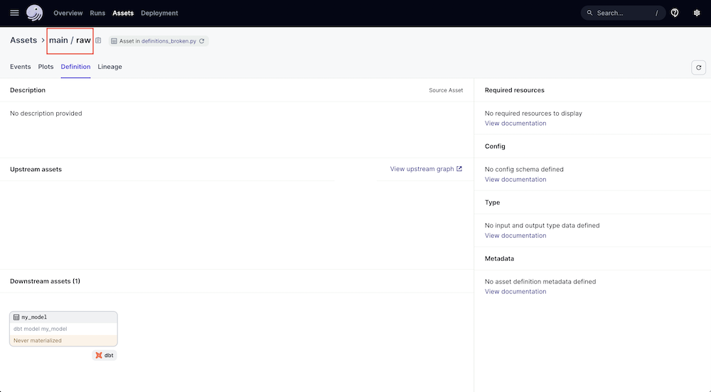

Dagster provides global lineage across tools, allowing data engineers to co-ordinate how data flows through their systems and visualize dependencies. A common use case is to create a Dagster project with an asset that loads source data to a warehouse and downstream assets that represent dbt models transforming that source data.

A common problem when first setting up this type of project is not having the correct lineage: 


This project shows why this problem occurs and how to fix it: 


## Get started

First setup the project by installing the necessary dependencies: 

```bash
pip install -r requirements.txt
```

To confirm everything is ready: 

```bash
python seed.py
dbt build --project-dir dbt_project --profiles-dir dbt_project
```

In `definitions_broken.py` we have a simple Dagster project that implements the common scenario described above. An asset, `my_source`, defines the data load. `dbt_assets` is used to ingest the dbt models into assets. To run this project: 

```
dagster dev -f definitions_broken.py
```

## Troubleshoot incorrect lineage

While the project loads, the lineage is incorrect. Why?

If we select our asset, `my_source`, we can see the asset key is "my_source" with no prefix: 


If, however, we look at the dbt asset, and click on `raw`, we can see that the dbt asset *expects* an upstream asset with the asset key "main / raw": 



**To create the proper lineage, we need to be sure that the upstream asset we are creating has the same asset key as what the dbt asset is expecting.** 

This is true even if the upstream asset is coming from an integration, such as `load_assets_from_airbyte_instance` or `load_assets_from_fivetran_instance`. 

How do we know what the dbt asset is expecting for the upstream asset key? When Dagster loads a dbt project via `dbt_assets`, it uses the dbt manifest to determine the lineage. The upstreams are based on the dbt `{{ source() }}` references. In this case, the dbt model `my_model` has a source named `main.raw` which dagster translates into an asset with the key "main/raw". 

## Fix the lineage

To fix the lineage graph, we need to force the asset keys to line up. There are three ways: 

1. Modify the upstream asset so the asset key matches what the dbt asset automatically expects.

2. Modify the dbt sources.yaml to manually specify what asset key in Dagster represents a given dbt source. 

3. Create a `CustomDbtTranslator` to programmatically modify what asset keys in Dagster map to dbt sources.

### Option 1

We can adjust the code in definitions_broken.py so that the `my_source` asset includes an asset key that matches the expected dbt behavior. This option works well if you have full control over the upstream assets. 

```python 
@asset(
    compute_kind = 'duckdb',
    key=["main", "raw"]
)
def my_source():
    """ A function that loads data into our database """
    load_raw()
```


### Option 2

We can adjust dbt_project/models/sources.yml to manually map the source table `raw` to the dagster asset key `my_source`: 

```yml
version: 2

sources:
  - name: main
    tables:
      - name: raw
        meta: 
          dagster:
            asset_key: ["my_source"]
```


### Option 3

Option 2 can be tedious if you have many assets. A programmatic way to map the dbt sources to dagster asset keys is by creating a `CustomDbtTranslator`. The following alternative to `definitions_broken.py` shows the approach, relying on the asset `raw` matching the dbt source table name: "raw" which is specified as upstream key in the custom dbt translator.

```python 
from dagster import asset, Definitions, AssetExecutionContext, AssetKey
from dagster_dbt import dbt_assets, DbtCliResource, DagsterDbtTranslator
from seed import load_raw
import os
from pathlib import Path

from dagster_dbt import DbtCliResource

@asset(
    compute_kind = 'duckdb'
)
def raw():
    """ A function that loads data into our database """
    load_raw()


DBT_PROJECT = "dbt_project"
MANIFEST = DBT_PROJECT + "/target/manifest.json"
dbt = DbtCliResource(project_dir=DBT_PROJECT)

# always re-genereate the manifest on project reload
dbt.cli(["--quiet", "parse"], target_path=Path("target")).wait()

class CustomDagsterDbtTranslator(DagsterDbtTranslator):
    def get_asset_key(self, dbt_resource_props):
        key = super().get_asset_key(dbt_resource_props) # default

        # dbt_resorce_props is a dict with this metadata: https://schemas.getdbt.com/dbt/manifest/v11/index.html#nodes_additionalProperties
        if dbt_resource_props["resource_type"] == "source":
            # adjust the key as necessary, here removing the prefix
            key = AssetKey(dbt_resource_props["name"])
        
        return key 

@dbt_assets(
    manifest=MANIFEST,
    dagster_dbt_translator=CustomDagsterDbtTranslator()
)
def my_dbt_assets(context: AssetExecutionContext, dbt: DbtCliResource):
    """ Function to create assets for dbt models """
    yield from dbt.cli(["build"], context=context).stream()


defs = Definitions(
    assets=[raw, my_dbt_assets], 
    resources = {"dbt": dbt}
)
```

